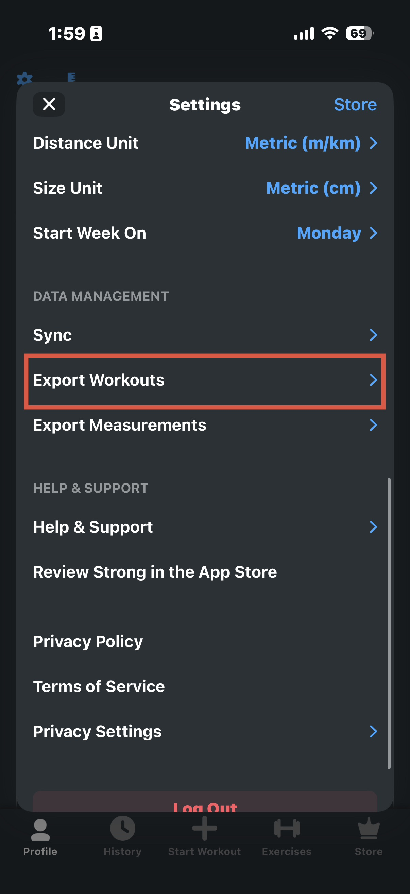
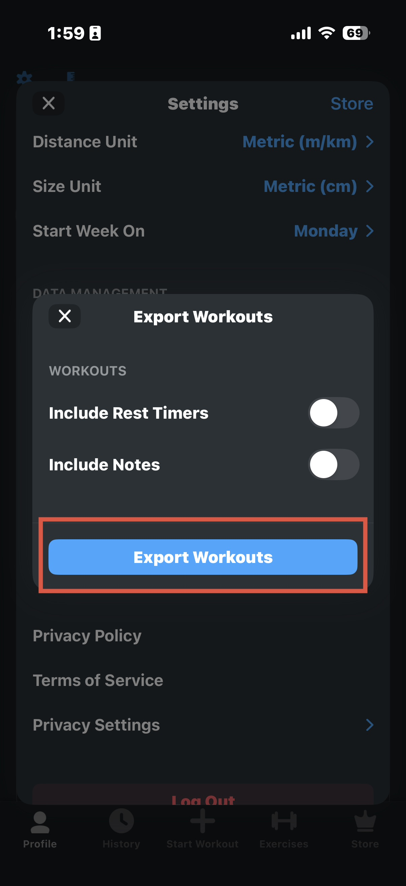
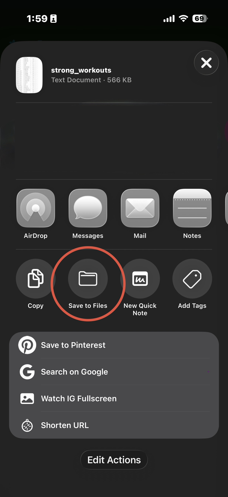

# setdown

side project. visualize your Strong workout export.

**setdown** — *drop your Strong export, see your numbers*

A privacy-first web app that parses your Strong CSV locally, shows progress dashboards, and offers an AI coach powered by Claude.

## Export from Strong (3 steps)

Get your CSV from the Strong app before opening setdown.

### Step 1 — Open Export Workouts

In Strong, go to **Profile → Settings**, scroll to **Data Management**, and tap **Export Workouts**.



### Step 2 — Export

On the export screen, tap the blue **Export Workouts** button.



### Step 3 — Save the file

When the share sheet appears, choose **Save to Files** (or AirDrop/email to your computer). You should get a file named something like `strong_workouts.csv`.



Then open [setdown](https://setdown.gradiense.com) (or run locally below) and drop that CSV in.

---

## Features

- Drag-and-drop Strong CSV upload
- Overview stats, weekly volume chart, PRs
- Per-exercise weight/volume trends
- Session history with set-level detail
- AI Q&A (summary stats only — not your full CSV)
- Dark WHOOP-inspired UI, mobile-first
- All workout data stays in IndexedDB on your device

## Quick start

```bash
npm install
cp .env.example .env.local   # add ANTHROPIC_API_KEY for AI
npm run dev
```

Open [http://localhost:3000](http://localhost:3000) and upload your `strong_workouts.csv`.

## Environment

| Variable | Required | Description |
|----------|----------|-------------|
| `ANTHROPIC_API_KEY` | For AI only | Claude API key (server-side) |

## Scripts

- `npm run dev` — development server
- `npm run build` — production build
- `npm run test` — unit tests (CSV parser)

## Deploy (Vercel)

1. Push to GitHub and import in Vercel
2. Set `ANTHROPIC_API_KEY` in project env
3. Add domain `setdown.gradiense.com` (CNAME → `cname.vercel-dns.com`)

## Privacy

Your CSV is processed in the browser. Only a compact JSON summary is sent to Claude when you ask a question. Workout data is not stored on the server.

## License

MIT — side project, not affiliated with Strong.
