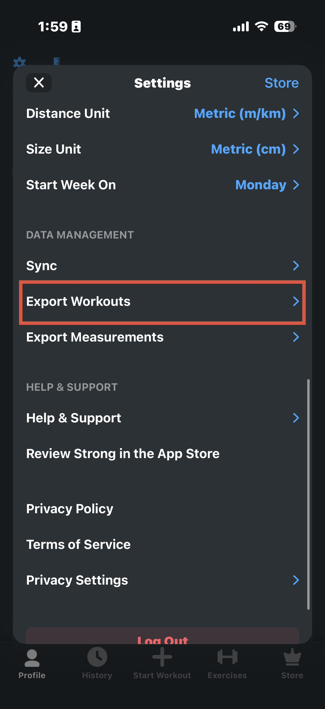
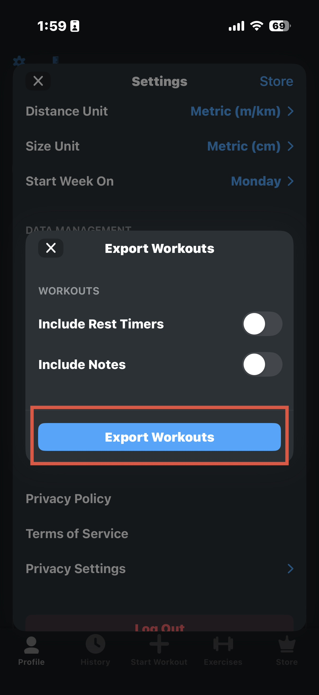
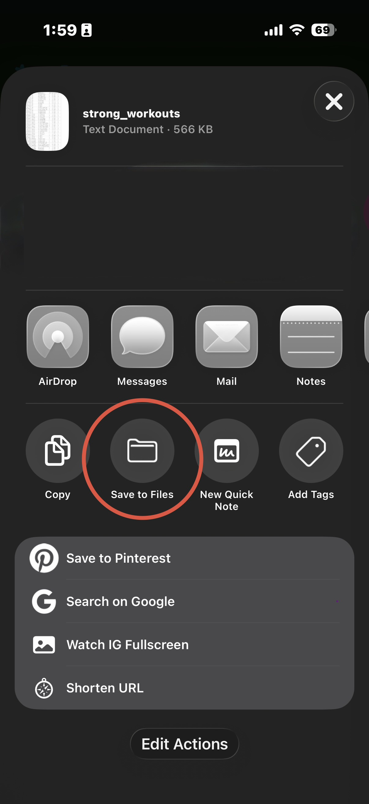

# setdown

side project. visualize your Strong workout export.

**setdown**: *drop your Strong export, see your numbers*

A privacy-first web app that parses your Strong CSV locally and shows progress dashboards.

## Export from Strong (3 steps)

Get your CSV from the Strong app before opening setdown.

### Step 1: Open Export Workouts

In Strong, go to **Profile → Settings**, scroll to **Data Management**, and tap **Export Workouts**.



### Step 2: Export

On the export screen, tap the blue **Export Workouts** button.



### Step 3: Save the file

When the share sheet appears, choose **Save to Files** (or AirDrop/email to your computer). You should get a file named something like `strong_workouts.csv`.



Then open [setdown](https://setdown.gradiense.com) (or run locally below) and drop that CSV in.

---

## Features

- Drag-and-drop Strong CSV upload
- Overview stats, weekly volume chart, PRs
- Per-exercise weight/volume trends
- Session history with set-level detail
- Dark WHOOP-inspired UI, mobile-first
- All workout data stays in IndexedDB on your device

## Quick start

```bash
npm install
npm run dev
```

No environment variables, no API keys, nothing to configure.

Open [http://localhost:3000](http://localhost:3000) and upload your `strong_workouts.csv`.

## Scripts

- `npm run dev`: development server
- `npm run build`: production build
- `npm run test`: unit tests (CSV parser)

## Deploy (Vercel)

1. Push to GitHub and import in Vercel
2. Add domain `setdown.gradiense.com` (CNAME → `cname.vercel-dns.com`)

## Privacy

There is no backend. There is no account and nothing to sign in to.

Your CSV is read and parsed entirely in the browser, and the parsed result is stored in IndexedDB on your device. Nothing is uploaded, and there is no server-side storage of any kind. Clearing your data in settings (or clearing site data in your browser) removes it for good.

## License

MIT. Side project, not affiliated with Strong.
