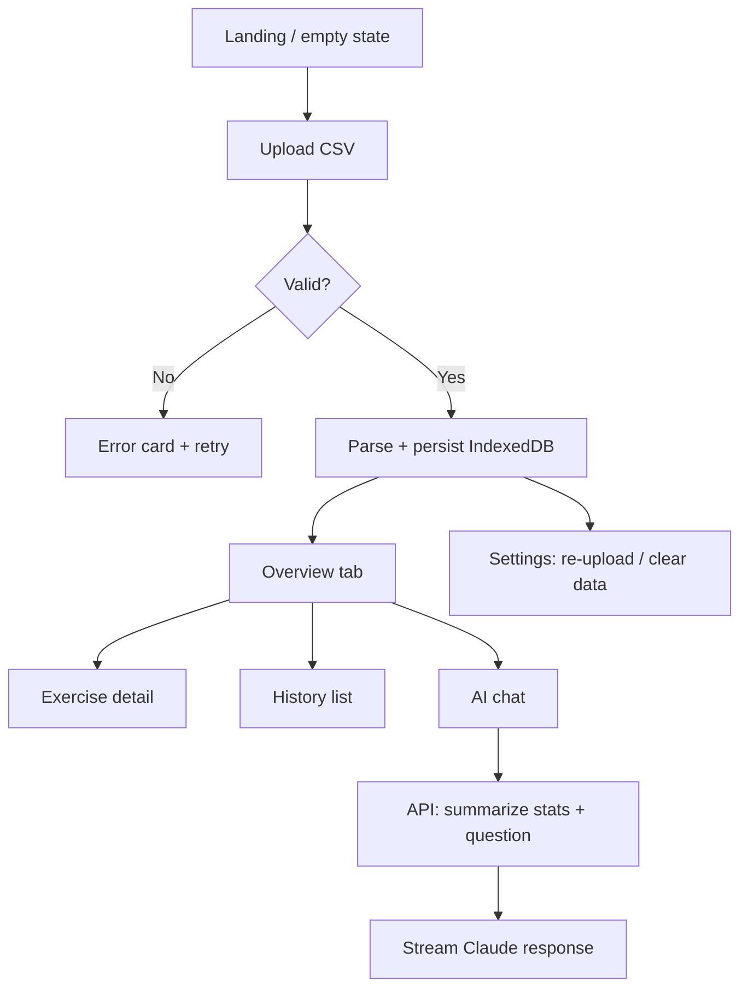

# setdown — Product & Technical Spec

**Version:** 1.0  
**Date:** 2026-05-21  
**Name:** setdown (side project; not affiliated with Strong)  
**Host:** `setdown.gradiense.com` (Vercel)  
**Repo:** `setdown`  
**Reference UI:** WHOOP (dark, data-dense, card-based)  
**Sample data:** `strong_workouts 2.csv` (~6k rows, Sep 2023 – May 2026)

### Branding

| | |
|---|---|
| **Display** | setdown |
| **Tagline** | *drop your Strong export, see your numbers* |
| **Tone** | Open-source chill; honest about being a CSV viewer |
| **README opener** | “side project. visualize your Strong workout export.” |

---

## 1. Product summary

**setdown** is a personal, single-user web app that:

1. Accepts a **Strong app CSV export** (drag-and-drop or file picker).
2. Parses and stores workout history **in the browser** (no account DB in v1).
3. Shows **progress dashboards** (volume, frequency, PRs, per-exercise trends).
4. Offers an **AI coach** powered by **Claude** (API key server-side) to answer questions about the loaded data.

Privacy-first: data never leaves the device except when the user explicitly asks the AI (summarized context sent to Claude).

---

## 2. Goals & non-goals

### Goals (MVP)

| Goal | Success criteria |
|------|------------------|
| Upload & parse Strong CSV | Handles sample file; shows clear errors on bad format |
| Overview dashboard | At-a-glance: workouts/week, total volume trend, recent session |
| Exercise detail | Pick exercise → weight/rep/volume over time |
| Workout history | List sessions; drill into sets |
| AI Q&A | Pill input “Ask about your training…”; streaming or chunked reply |
| WHOOP-like UI | Dark theme, cards, tabs, minimal charts, mobile-first |
| Deploy on Vercel | Production URL on custom subdomain |

### Non-goals (v1)

- User accounts / multi-tenant auth
- Syncing with Strong API (export-only)
- Workout logging or editing
- Native mobile app
- RPE analysis (sample export has empty `RPE` column)
- Public sharing / social

---

## 3. Input data — Strong CSV contract

### 3.1 Schema (from sample)

| Column | Type | Notes |
|--------|------|-------|
| `Date` | string | e.g. `2023-09-27 2:07:56 p.m.` — locale-specific; parser must be tolerant |
| `Workout Name` | string | Template label, e.g. `"legs"`, `"chest n back"` |
| `Duration` | string | Human-readable: `1h 38m`, `1h 2m`, `45m` |
| `Exercise Name` | string | e.g. `"Bench Press (Dumbbell)"` |
| `Set Order` | string | See §3.2 |
| `Weight` | number | kg in sample (assume kg unless user setting added later) |
| `Reps` | number | |
| `Distance` | number | Cardio; mostly `0` in sample |
| `Seconds` | number | Timed sets; mostly `0` in sample |
| `RPE` | string | Often empty |

**Grain:** one row = one set.

**Session key:** `(Date, Workout Name)` — same timestamp + name = one workout (~270 sessions in sample).

### 3.2 Set Order semantics

Observed in sample:

| Code | Meaning (inferred) | Include in volume/PR? |
|------|-------------------|------------------------|
| `W` | Warm-up | Optional toggle (default: exclude) |
| `1`–`6` | Working set index | Yes |
| `D` | Drop set | Yes |
| `F` | Failure / AMRAP set | Yes |

Parser should preserve raw `Set Order` and map to `setType: 'warmup' | 'working' | 'dropset' | 'failure'`.

### 3.3 Derived metrics

```text
setVolume     = weight × reps          (when reps > 0)
exerciseVolume(session, exercise) = Σ setVolume for included set types
workoutVolume(session)            = Σ exerciseVolume
estimated1RM  = epley(weight, reps)  optional: weight × (1 + reps/30)
durationMinutes = parseDuration("1h 38m") → 98
```

**PR detection:** per exercise, track max weight (per rep bracket), max volume set, max session volume.

### 3.4 Parsing edge cases

- **Date strings:** Use `date-fns` + fallback regex; strip narrow no-break spaces (`\u202f`) from sample.
- **Duplicate rows:** Dedupe not required; treat as logged sets.
- **Zero reps:** Exclude from volume; still show in set list.
- **Re-import:** Replace in-memory dataset or merge by session key (MVP: **replace** with confirmation).
- **File size:** Sample ~6k rows is fine client-side; cap upload at **10 MB**.

### 3.5 Normalized types (TypeScript)

```typescript
type SetType = 'warmup' | 'working' | 'dropset' | 'failure' | 'unknown';

interface WorkoutSet {
  id: string;
  date: Date;
  workoutName: string;
  durationMinutes: number | null;
  exerciseName: string;
  setOrder: string;
  setType: SetType;
  setIndex: number | null;
  weight: number;
  reps: number;
  distance: number;
  seconds: number;
  rpe: number | null;
  volume: number;
}

interface WorkoutSession {
  id: string; // hash(date + workoutName)
  date: Date;
  workoutName: string;
  durationMinutes: number | null;
  sets: WorkoutSet[];
  totalVolume: number;
  exerciseCount: number;
}

interface WorkoutDataset {
  importedAt: string;
  fileName: string;
  sessions: WorkoutSession[];
  exercises: string[];
  dateRange: { start: Date; end: Date };
}
```

---

## 4. User flows



### 4.1 First visit

- Full-screen dark layout.
- Hero card: “Drop your export” + dashed drop zone (WHOOP “Start an Activity” pattern).
- Subcopy: “Strong → Settings → Export data” (small, muted).

### 4.2 Returning visit

- Load dataset from IndexedDB; skip upload if present.
- Header: date range, “Replace file” in overflow menu.

### 4.3 AI flow

1. User types question in pill bar (e.g. “Am I progressing on bench press?”).
2. Client builds a **compact JSON summary** (not full 6k rows): totals, top exercises, recent 4-week deltas, PRs.
3. `POST /api/chat` with `{ message, context }`.
4. Server calls Claude with system prompt + context; returns streamed text.
5. Render in insight card(s) below input; keep last N messages in session storage.

---

## 5. Information architecture & screens

### 5.1 Global chrome (WHOOP-inspired)

| Element | Spec |
|---------|------|
| Background | `#0A0A0B` / `#0F141A` |
| Card surface | `#1A2128` / `#1C1C1E`, radius `12–16px` |
| Primary text | `#FFFFFF` |
| Muted labels | `#7D8B9A`, ALL CAPS, `letter-spacing: 0.08em`, `text-xs` |
| Accents | Blue `#00C2FF` (strain/charts), Green `#00FF9D` (positive/save), Yellow `#FFD60A` (highlights), Red `#FF3B30` (destructive) |
| Font | `Inter` or `Geist` via `next/font` |
| Icons | `lucide-react`, 1.5px stroke |
| Bottom nav | Home (Overview), Exercises, History, More (settings) |
| Top tabs (Overview) | OVERVIEW · VOLUME · PRS · AI (underline active) |
| FAB | White circle `+` → “Upload new CSV” (bottom-right) |

### 5.2 Screen: Overview

**Layout (top → bottom):**

1. **Header row** — Profile placeholder | `< OCT 2025 >` month switcher | status dot  
2. **Ring / hero metric** (optional v1.1) — circular gauge: “Sessions this week” vs 4-week avg  
3. **Key statistics** (WHOOP list rows)  
   - `WORKOUTS / 4 WKS` — count  
   - `TOTAL VOLUME` — kg·reps, trend ▲/▼ vs prior 4 wks  
   - `AVG DURATION` — parsed minutes  
   - `TOP EXERCISE` — highest volume last 4 wks  
4. **Stress-style chart card** — “TRAINING LOAD” — line chart: weekly total volume (12–16 weeks)  
5. **Insight card** — bordered card; AI-generated weekly summary (button: “Generate insight”)  
6. **Today’s activities** — last 3 sessions as cards: name, duration, exercise count  

### 5.3 Screen: Exercise detail

- Search / filter chips for 142 exercises.
- Large metric: **estimated 1RM** or **max weight** (last 90 days).
- Line chart: max weight per session over time (filter: top set only, exclude warmups).
- Secondary chart: volume per session.
- Set history table (collapsible): date, sets, weight×reps.

### 5.4 Screen: History

- Reverse-chronological session cards.
- Tap → session detail: exercises grouped, sets listed, session volume footer.

### 5.5 Screen: AI

- Sticky pill input: “Ask about your training…”
- Suggested chips: “Volume trend”, “Plateau risks”, “What should I focus on?”
- Message list (user dark bubble / assistant insight card).

### 5.6 Screen: Settings (More)

- Replace CSV  
- Clear all data  
- Units: kg / lb (display only in v1; store raw)  
- About / privacy note  

---

## 6. Visualizations

| Chart | Library | Config |
|-------|---------|--------|
| Weekly volume | Recharts `AreaChart` or `LineChart` | No grid; thin stroke `#00C2FF`; gradient fill 10% opacity |
| Exercise progression | `LineChart` | Multiple series optional; dots on PR points |
| Session duration | `BarChart` | Muted bars `#2A3540` |
| Sparklines in stat rows | Tiny `LineChart` 80×24px | |

**Tooltip:** dark card, white text, one decimal.

---

## 7. AI integration (Claude)

### 7.1 Environment

```bash
ANTHROPIC_API_KEY=sk-ant-...   # Vercel env, Production + Preview
```

Use `@anthropic-ai/sdk` in a Route Handler.

### 7.2 Context payload (built client-side)

Keep under **~8k tokens**:

```typescript
interface AIContext {
  dateRange: { start: string; end: string };
  totalSessions: number;
  sessionsLast4Weeks: number;
  volumeLast4Weeks: number;
  volumePrior4Weeks: number;
  volumeChangePercent: number;
  workoutsPerWeekAvg: number;
  topExercisesByVolume: { name: string; volume: number }[]; // top 10
  recentPRs: { exercise: string; metric: string; value: number; date: string }[]; // top 15
  exerciseTrends?: { name: string; maxWeightSeries: [string, number][] }; // only if user asks re: specific lift
  userMessage: string;
}
```

### 7.3 System prompt (sketch)

```text
You are a concise strength-training analyst. The user exported data from the Strong app.
Use only the provided JSON summary. Be specific with numbers and dates.
Prefer short paragraphs and bullet points. Flag limitations (e.g. missing RPE).
Do not invent workouts or weights not in the context.
```

### 7.4 API route

`POST /api/chat`

- Body: `{ message: string, context: AIContext }`
- Rate limit: simple in-memory or Vercel KV later (10 req/min/IP for MVP)
- Model: `claude-sonnet-4-20250514` (or current Sonnet default)
- `max_tokens`: 1024
- Return: `ReadableStream` for SSE-style streaming to UI

**Security:** API key never exposed to client; validate `Content-Type` and max body size (32kb).

---

## 8. Technical architecture

### 8.1 Stack

| Layer | Choice |
|-------|--------|
| Framework | **Next.js 15+** (App Router) |
| Language | TypeScript |
| Styling | **Tailwind CSS v4** + CSS variables for theme |
| Charts | **Recharts** |
| CSV parse | **Papa Parse** (`papaparse`) |
| Client storage | **IndexedDB** via `idb-keyval` or Dexie |
| AI | `@anthropic-ai/sdk` |
| Deploy | **Vercel** |
| Analytics | Optional: Vercel Analytics (privacy-friendly) |

### 8.2 Project structure

```text
setdown/
├── app/
│   ├── layout.tsx              # dark theme, fonts, metadata
│   ├── page.tsx                # redirect or overview
│   ├── (dashboard)/
│   │   ├── layout.tsx          # bottom nav + shell
│   │   ├── overview/page.tsx
│   │   ├── exercises/page.tsx
│   │   ├── exercises/[slug]/page.tsx
│   │   ├── history/page.tsx
│   │   ├── history/[sessionId]/page.tsx
│   │   ├── ai/page.tsx
│   │   └── settings/page.tsx
│   ├── upload/page.tsx         # first-run upload
│   └── api/
│       └── chat/route.ts
├── components/
│   ├── ui/                     # Card, StatRow, TabBar, PillInput, FAB
│   ├── charts/
│   └── upload/
├── lib/
│   ├── parse-strong-csv.ts
│   ├── metrics.ts
│   ├── ai-context.ts
│   └── storage.ts
├── public/
├── SPEC.md
├── package.json
└── vercel.json                 # optional headers
```

### 8.3 Data flow

```text
CSV file → Papa Parse → WorkoutSet[] → groupBy session → WorkoutDataset
                                              ↓
                                    IndexedDB ("setdown-dataset-v1")
                                              ↓
                         React context / hooks ← metrics selectors
                                              ↓
                         Charts + AI context builder → /api/chat
```

All parsing and aggregation run **client-side** (Web Worker optional if >50k rows).

### 8.4 Routing & states

| Route | Condition |
|-------|-----------|
| `/upload` | No dataset in IDB |
| `/overview` | Dataset exists (default) |

Middleware (lightweight): read cookie `has-data=1` or skip — prefer client guard to avoid flash.

---

## 9. Deployment & domain

### 9.1 Vercel

1. Create Git repo `setdown`.
2. Import project in Vercel; framework preset Next.js; project name **setdown**.
3. Set env: `ANTHROPIC_API_KEY`.
4. Production branch: `main`.

### 9.2 Custom domain `setdown.gradiense.com`

1. Vercel project → **Settings → Domains** → Add `setdown.gradiense.com`.
2. DNS at Gradiense host (or Cloudflare):

   ```text
   Type: CNAME
   Name: setdown
   Value: cname.vercel-dns.com
   ```

3. Wait for SSL (Vercel auto).
4. Optional: redirect `www` → apex or subdomain only.

### 9.3 `vercel.json` (optional)

```json
{
  "headers": [
    {
      "source": "/(.*)",
      "headers": [
        { "key": "X-Content-Type-Options", "value": "nosniff" },
        { "key": "Referrer-Policy", "value": "strict-origin-when-cross-origin" }
      ]
    }
  ]
}
```

---

## 10. Security & privacy

| Topic | Approach |
|-------|----------|
| Workout data | Stays in browser (IndexedDB); not sent to server except AI summary |
| API key | Server-only `ANTHROPIC_API_KEY` |
| AI requests | User-initiated; log no raw CSV on server |
| HTTPS | Enforced via Vercel |
| CSP | Default Next; tighten if needed |
| File upload | Client-only read; no `multipart` to server |

**Privacy copy (Settings):**  
“Your CSV is processed on this device. Only a short summary is sent to Claude when you ask a question.”

---

## 11. Implementation phases

### Phase 1 — Foundation (2–3 days)

- [ ] `create-next-app` + Tailwind + theme tokens
- [ ] CSV parser + unit tests (fixture: sample CSV snippet)
- [ ] IndexedDB persistence
- [ ] Upload page + replace flow

### Phase 2 — Dashboard (2–3 days)

- [ ] Overview layout + stat rows
- [ ] Weekly volume chart
- [ ] History list + session detail
- [ ] Bottom nav + tabs

### Phase 3 — Exercises (1–2 days)

- [ ] Exercise list + search
- [ ] Detail charts + PR badges

### Phase 4 — AI (1–2 days)

- [ ] `/api/chat` + streaming UI
- [ ] Context builder + suggested prompts

### Phase 5 — Deploy (0.5 day)

- [ ] Vercel prod + `setdown.gradiense.com`
- [ ] Smoke test on mobile Safari

**Total estimate:** ~7–10 days for one developer.

---

## 12. Testing checklist

| Test | Expected |
|------|----------|
| Upload sample CSV | 270 sessions, 142 exercises |
| Re-upload | Confirmation → data replaced |
| Warmup toggle | Volume recalculates |
| Empty CSV | Error message |
| Wrong columns | Validation error |
| AI without data | Disabled input + hint |
| AI with data | Coherent answer citing stats |
| Offline after load | Overview still works |
| Mobile 390px | Nav + cards usable |

---

## 13. UI component checklist (WHOOP mapping)

| WHOOP pattern | Component |
|---------------|-----------|
| Dark full-bleed background | `DashboardLayout` |
| ALL CAPS section labels | `SectionLabel` |
| Stat row (icon, label, value, trend) | `StatRow` |
| Card with title | `MetricCard` |
| Thin line chart | `TrendChart` |
| Insight paragraph card | `InsightCard` |
| Pill AI input | `ChatInput` |
| Tab underline | `TabNav` |
| FAB `+` | `UploadFab` |
| Dashed CTA card | `EmptyStateCard` |
| Green outline Save button | `PrimaryButton variant="outline-green"` |

---

## 14. Open questions (decide before build)

1. ~~**Project name / subdomain**~~ — **setdown** / `setdown.gradiense.com` ✓
2. **Weight units** — Sample appears metric (kg). Confirm or add lb toggle.
3. **Warmups in volume** — Default exclude `W` sets?
4. **AI model tier** — Sonnet vs Haiku for cost/latency.
5. **Auth** — Needed if app might be public URL (optional basic `middleware` password for v1).

---

## 15. Sample metrics (from provided CSV)

Useful for validating dashboards:

| Metric | Value |
|--------|-------|
| Rows | 6,079 |
| Sessions | 270 |
| Exercises | 142 |
| Date range | 2023-09-27 → 2026-05-13 |
| Set types | W, 1–6, D, F |
| RPE populated | 0% |
| Top templates | chest n triceps, legs, back n biceps |

---

## 16. Dependencies (starter `package.json`)

```json
{
  "name": "setdown",
  "dependencies": {
    "next": "^15.0.0",
    "react": "^19.0.0",
    "react-dom": "^19.0.0",
    "@anthropic-ai/sdk": "^0.39.0",
    "papaparse": "^5.4.1",
    "recharts": "^2.15.0",
    "date-fns": "^4.1.0",
    "idb-keyval": "^6.2.1",
    "lucide-react": "^0.460.0",
    "clsx": "^2.1.1",
    "tailwind-merge": "^2.5.4"
  },
  "devDependencies": {
    "typescript": "^5.6.0",
    "@types/papaparse": "^5.3.15",
    "vitest": "^2.1.0"
  }
}
```

---

## 17. Acceptance criteria (MVP done)

1. User can upload `strong_workouts*.csv` and see overview within 5s on sample file.
2. Weekly volume chart shows ≥12 weeks of history.
3. User can open any exercise and see a weight-over-time line.
4. User can browse session history and view set-level detail.
5. User can ask Claude one question and receive a grounded answer using real summary stats.
6. Site runs on Vercel at `https://setdown.gradiense.com` with valid SSL.
7. UI matches dark WHOOP aesthetic (cards, typography, accent colors) on mobile width.

---

*Next step: scaffold the `setdown` Next.js repo and implement Phase 1.*
