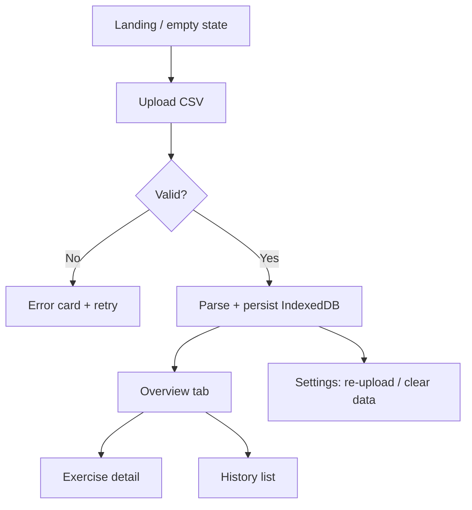

# setdown — Product & Technical Spec

**Version:** 1.0  
**Date:** 2026-05-21  
**Name:** setdown (side project; not affiliated with Strong)  
**Host:** `setdown.gradiense.com` (Vercel)  
**Repo:** `setdown`  
**Reference UI:** WHOOP (dark, data-dense, card-based)  
**Sample data:** `strong_workouts 2.csv` (~6k rows, Sep 2023 – May 2026)

### Branding

| | |
|---|---|
| **Display** | setdown |
| **Tagline** | *drop your Strong export, see your numbers* |
| **Tone** | Open-source chill; honest about being a CSV viewer |
| **README opener** | “side project. visualize your Strong workout export.” |

---

## 1. Product summary

**setdown** is a personal, single-user web app that:

1. Accepts a **Strong app CSV export** (drag-and-drop or file picker).
2. Parses and stores workout history **in the browser** (IndexedDB).
3. Shows **progress dashboards** (volume, frequency, PRs, per-exercise trends).

Privacy-first: there is no backend and no account. Data never leaves the device.

---

## 2. Goals & non-goals

### Goals (MVP)

| Goal | Success criteria |
|------|------------------|
| Upload & parse Strong CSV | Handles sample file; shows clear errors on bad format |
| Overview dashboard | At-a-glance: workouts/week, total volume trend, recent session |
| Exercise detail | Pick exercise → weight/rep/volume over time |
| Workout history | List sessions; drill into sets |
| WHOOP-like UI | Dark theme, cards, tabs, minimal charts, mobile-first |
| Deploy on Vercel | Production URL on custom subdomain |

### Non-goals

- User accounts, sign-in, or any server-side storage
- Syncing with Strong API (export-only)
- Workout logging or editing
- Native mobile app
- RPE analysis (sample export has empty `RPE` column)
- Public sharing / social

---

## 3. Input data — Strong CSV contract

### 3.1 Schema (from sample)

| Column | Type | Notes |
|--------|------|-------|
| `Date` | string | e.g. `2023-09-27 2:07:56 p.m.` — locale-specific; parser must be tolerant |
| `Workout Name` | string | Template label, e.g. `"legs"`, `"chest n back"` |
| `Duration` | string | Human-readable: `1h 38m`, `1h 2m`, `45m` |
| `Exercise Name` | string | e.g. `"Bench Press (Dumbbell)"` |
| `Set Order` | string | See §3.2 |
| `Weight` | number | kg in sample (assume kg unless user setting added later) |
| `Reps` | number | |
| `Distance` | number | Cardio; mostly `0` in sample |
| `Seconds` | number | Timed sets; mostly `0` in sample |
| `RPE` | string | Often empty |

**Grain:** one row = one set.

**Session key:** `(Date, Workout Name)` — same timestamp + name = one workout (~270 sessions in sample).

### 3.2 Set Order semantics

Observed in sample:

| Code | Meaning (inferred) | Include in volume/PR? |
|------|-------------------|------------------------|
| `W` | Warm-up | Optional toggle (default: exclude) |
| `1`–`6` | Working set index | Yes |
| `D` | Drop set | Yes |
| `F` | Failure / AMRAP set | Yes |

Parser should preserve raw `Set Order` and map to `setType: 'warmup' | 'working' | 'dropset' | 'failure'`.

### 3.3 Derived metrics

```text
setVolume     = weight × reps          (when reps > 0)
exerciseVolume(session, exercise) = Σ setVolume for included set types
workoutVolume(session)            = Σ exerciseVolume
estimated1RM  = epley(weight, reps)  optional: weight × (1 + reps/30)
durationMinutes = parseDuration("1h 38m") → 98
```

**PR detection:** per exercise, track max weight (per rep bracket), max volume set, max session volume.

### 3.4 Parsing edge cases

- **Date strings:** Use `date-fns` + fallback regex; strip narrow no-break spaces (`\u202f`) from sample.
- **Duplicate rows:** Dedupe not required; treat as logged sets.
- **Zero reps:** Exclude from volume; still show in set list.
- **Re-import:** Replace in-memory dataset or merge by session key (MVP: **replace** with confirmation).
- **File size:** Sample ~6k rows is fine client-side; cap upload at **10 MB**.

### 3.5 Normalized types (TypeScript)

```typescript
type SetType = 'warmup' | 'working' | 'dropset' | 'failure' | 'unknown';

interface WorkoutSet {
  id: string;
  date: Date;
  workoutName: string;
  durationMinutes: number | null;
  exerciseName: string;
  setOrder: string;
  setType: SetType;
  setIndex: number | null;
  weight: number;
  reps: number;
  distance: number;
  seconds: number;
  rpe: number | null;
  volume: number;
}

interface WorkoutSession {
  id: string; // hash(date + workoutName)
  date: Date;
  workoutName: string;
  durationMinutes: number | null;
  sets: WorkoutSet[];
  totalVolume: number;
  exerciseCount: number;
}

interface WorkoutDataset {
  importedAt: string;
  fileName: string;
  sessions: WorkoutSession[];
  exercises: string[];
  dateRange: { start: Date; end: Date };
}
```

---

## 4. User flows


```mermaid
flowchart TD
  A[Landing / empty state] --> B[Upload CSV]
  B --> C{Valid?}
  C -->|No| D[Error card + retry]
  C -->|Yes| E[Parse + persist IndexedDB]
  E --> F[Overview tab]
  F --> G[Exercise detail]
  F --> H[History list]
  E --> L[Settings: re-upload / clear data]
```

### 4.1 First visit

- Full-screen dark layout.
- Hero card: “Drop your export” + dashed drop zone (WHOOP “Start an Activity” pattern).
- Subcopy: “Strong → Settings → Export data” (small, muted).

### 4.2 Returning visit

- Load dataset from IndexedDB; skip upload if present.
- Header: date range, “Replace file” in overflow menu.

---

## 5. Information architecture & screens

### 5.1 Global chrome (WHOOP-inspired)

| Element | Spec |
|---------|------|
| Background | `#0A0A0B` / `#0F141A` |
| Card surface | `#1A2128` / `#1C1C1E`, radius `12–16px` |
| Primary text | `#FFFFFF` |
| Muted labels | `#7D8B9A`, ALL CAPS, `letter-spacing: 0.08em`, `text-xs` |
| Accents | Blue `#00C2FF` (strain/charts), Green `#00FF9D` (positive/save), Yellow `#FFD60A` (highlights), Red `#FF3B30` (destructive) |
| Font | `Inter` or `Geist` via `next/font` |
| Icons | `lucide-react`, 1.5px stroke |
| Bottom nav | Home (Overview), Exercises, History, More (settings) |
| Top tabs (Overview) | OVERVIEW · VOLUME · PRS (underline active) |
| FAB | White circle `+` → “Upload new CSV” (bottom-right) |

### 5.2 Screen: Overview

**Layout (top → bottom):**

1. **Header row** — Profile placeholder | `< OCT 2025 >` month switcher | status dot  
2. **Ring / hero metric** (optional v1.1) — circular gauge: “Sessions this week” vs 4-week avg  
3. **Key statistics** (WHOOP list rows)  
   - `WORKOUTS / 4 WKS` — count  
   - `TOTAL VOLUME` — kg·reps, trend ▲/▼ vs prior 4 wks  
   - `AVG DURATION` — parsed minutes  
   - `TOP EXERCISE` — highest volume last 4 wks  
4. **Stress-style chart card** — “TRAINING LOAD” — line chart: weekly total volume (12–16 weeks)  
5. **Today’s activities** — last 3 sessions as cards: name, duration, exercise count  

### 5.3 Screen: Exercise detail

- Search / filter chips for 142 exercises.
- Large metric: **estimated 1RM** or **max weight** (last 90 days).
- Line chart: max weight per session over time (filter: top set only, exclude warmups).
- Secondary chart: volume per session.
- Set history table (collapsible): date, sets, weight×reps.

### 5.4 Screen: History

- Reverse-chronological session cards.
- Tap → session detail: exercises grouped, sets listed, session volume footer.

### 5.5 Screen: Settings (More)

- Replace CSV  
- Clear all data  
- Units: kg / lb (display only in v1; store raw)  
- About / privacy note  

---

## 6. Visualizations

| Chart | Library | Config |
|-------|---------|--------|
| Weekly volume | Recharts `AreaChart` or `LineChart` | No grid; thin stroke `#00C2FF`; gradient fill 10% opacity |
| Exercise progression | `LineChart` | Multiple series optional; dots on PR points |
| Session duration | `BarChart` | Muted bars `#2A3540` |
| Sparklines in stat rows | Tiny `LineChart` 80×24px | |

**Tooltip:** dark card, white text, one decimal.

---

## 7. Technical architecture

### 7.1 Stack

| Layer | Choice |
|-------|--------|
| Framework | **Next.js 15+** (App Router) |
| Language | TypeScript |
| Styling | **Tailwind CSS v4** + CSS variables for theme |
| Charts | **Recharts** |
| CSV parse | **Papa Parse** (`papaparse`) |
| Client storage | **IndexedDB** via `idb-keyval` |
| Backend | None. Static/SSG front end only |
| Deploy | **Vercel** |
| Analytics | Optional: Vercel Analytics (privacy-friendly) |

### 7.2 Project structure

```text
setdown/
├── app/
│   ├── layout.tsx              # dark theme, fonts, metadata
│   ├── page.tsx                # landing
│   ├── (dashboard)/
│   │   ├── layout.tsx          # bottom nav + shell
│   │   ├── overview/page.tsx
│   │   ├── exercises/page.tsx
│   │   ├── exercises/[slug]/page.tsx
│   │   ├── history/page.tsx
│   │   ├── history/[sessionId]/page.tsx
│   │   └── settings/page.tsx
│   └── upload/page.tsx         # first-run upload
├── components/
│   ├── ui/                     # Card, StatRow, TabBar, FAB
│   ├── charts/
│   └── upload/
├── lib/
│   ├── parse-strong-csv.ts
│   ├── metrics.ts
│   └── storage.ts
├── public/
├── SPEC.md
├── package.json
└── vercel.json                 # optional headers
```

### 7.3 Data flow

```text
CSV file → Papa Parse → WorkoutSet[] → groupBy session → WorkoutDataset
                                              ↓
                                    IndexedDB ("setdown-dataset-v1")
                                              ↓
                         React context / hooks ← metrics selectors
                                              ↓
                                           Charts
```

All parsing and aggregation run **client-side** (Web Worker optional if >50k rows). There are no API routes and no server-side data access.

### 7.4 Routing & states

| Route | Condition |
|-------|-----------|
| `/upload` | No dataset in IDB |
| `/overview` | Dataset exists (default) |

Prefer a client guard over middleware to avoid a redirect flash.

---

## 8. Deployment & domain

### 8.1 Vercel

1. Create Git repo `setdown`.
2. Import project in Vercel; framework preset Next.js; project name **setdown**.
3. Production branch: `main`. No environment variables are required.

### 8.2 Custom domain `setdown.gradiense.com`

1. Vercel project → **Settings → Domains** → Add `setdown.gradiense.com`.
2. DNS at Gradiense host (or Cloudflare):

   ```text
   Type: CNAME
   Name: setdown
   Value: cname.vercel-dns.com
   ```

3. Wait for SSL (Vercel auto).
4. Optional: redirect `www` → apex or subdomain only.

### 8.3 `vercel.json` (optional)

```json
{
  "headers": [
    {
      "source": "/(.*)",
      "headers": [
        { "key": "X-Content-Type-Options", "value": "nosniff" },
        { "key": "Referrer-Policy", "value": "strict-origin-when-cross-origin" }
      ]
    }
  ]
}
```

---

## 9. Security & privacy

| Topic | Approach |
|-------|----------|
| Workout data | Stays in the browser (IndexedDB); never transmitted |
| Backend | None. No database, no API routes, no secrets to manage |
| HTTPS | Enforced via Vercel |
| CSP | Default Next; tighten if needed |
| File upload | Client-only read; no `multipart` to server |

**Privacy copy (Settings):**  
“Your CSV is processed on this device and stored in your browser. It never leaves.”

---

## 10. Implementation phases

### Phase 1 — Foundation (2–3 days)

- [ ] `create-next-app` + Tailwind + theme tokens
- [ ] CSV parser + unit tests (fixture: sample CSV snippet)
- [ ] IndexedDB persistence
- [ ] Upload page + replace flow

### Phase 2 — Dashboard (2–3 days)

- [ ] Overview layout + stat rows
- [ ] Weekly volume chart
- [ ] History list + session detail
- [ ] Bottom nav + tabs

### Phase 3 — Exercises (1–2 days)

- [ ] Exercise list + search
- [ ] Detail charts + PR badges

### Phase 4 — Deploy (0.5 day)

- [ ] Vercel prod + `setdown.gradiense.com`
- [ ] Smoke test on mobile Safari

**Total estimate:** ~6–8 days for one developer.

---

## 11. Testing checklist

| Test | Expected |
|------|----------|
| Upload sample CSV | 270 sessions, 142 exercises |
| Re-upload | Confirmation → data replaced |
| Warmup toggle | Volume recalculates |
| Empty CSV | Error message |
| Wrong columns | Validation error |
| Clear data | IndexedDB emptied, back to upload state |
| Offline after load | Overview still works |
| Mobile 390px | Nav + cards usable |

---

## 12. UI component checklist (WHOOP mapping)

| WHOOP pattern | Component |
|---------------|-----------|
| Dark full-bleed background | `DashboardLayout` |
| ALL CAPS section labels | `SectionLabel` |
| Stat row (icon, label, value, trend) | `StatRow` |
| Card with title | `MetricCard` |
| Thin line chart | `TrendChart` |
| Tab underline | `TabNav` |
| FAB `+` | `UploadFab` |
| Dashed CTA card | `EmptyStateCard` |
| Green outline Save button | `PrimaryButton variant="outline-green"` |

---

## 13. Open questions (decide before build)

1. ~~**Project name / subdomain**~~ — **setdown** / `setdown.gradiense.com` ✓
2. **Weight units** — Sample appears metric (kg). Confirm or add lb toggle.
3. **Warmups in volume** — Default exclude `W` sets?

---

## 14. Sample metrics (from provided CSV)

Useful for validating dashboards:

| Metric | Value |
|--------|-------|
| Rows | 6,079 |
| Sessions | 270 |
| Exercises | 142 |
| Date range | 2023-09-27 → 2026-05-13 |
| Set types | W, 1–6, D, F |
| RPE populated | 0% |
| Top templates | chest n triceps, legs, back n biceps |

---

## 15. Dependencies (starter `package.json`)

```json
{
  "name": "setdown",
  "dependencies": {
    "next": "^15.0.0",
    "react": "^19.0.0",
    "react-dom": "^19.0.0",
    "papaparse": "^5.4.1",
    "recharts": "^2.15.0",
    "date-fns": "^4.1.0",
    "idb-keyval": "^6.2.1",
    "lucide-react": "^0.460.0",
    "clsx": "^2.1.1",
    "tailwind-merge": "^2.5.4"
  },
  "devDependencies": {
    "typescript": "^5.6.0",
    "@types/papaparse": "^5.3.15",
    "vitest": "^2.1.0"
  }
}
```

---

## 16. Acceptance criteria (MVP done)

1. User can upload `strong_workouts*.csv` and see overview within 5s on sample file.
2. Weekly volume chart shows ≥12 weeks of history.
3. User can open any exercise and see a weight-over-time line.
4. User can browse session history and view set-level detail.
5. Site runs on Vercel at `https://setdown.gradiense.com` with valid SSL.
6. UI matches dark WHOOP aesthetic (cards, typography, accent colors) on mobile width.
